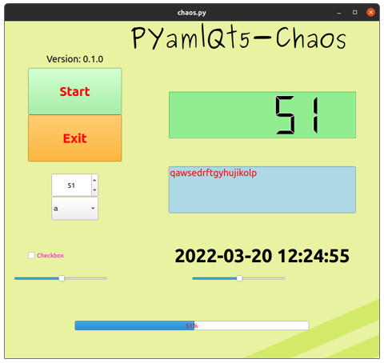

# PyamlQt（ぴゃむるきゅーと）

[](https://badge.fury.io/py/PyamlQt)

- [Zenn「最もシンプルなGUI設計パッケージPyamlQtについて」](https://zenn.dev/array/articles/9617ae0bbd8a80)

PyQt6 configuration in yaml format providing the most simple script.

## Requirements

- yaml
- PyQt6, ( PyQt5 )

## Installation

```bash
pip install PyamlQt
```

<!-- ```bash
git clone https://github.com/Ar-Ray-code/PyamlQt.git
cd PyamlQt
pip3 install -v -e . 
``` -->

## Demo

```bash
python3 examples/chaos.py
```

## Template

See `examples/simple_gui.py`.

```python
import sys
import os

from pyamlqt.mainwindow import PyamlQtWindow
from PyQt6.QtWidgets import QApplication

YAML = os.path.join(os.path.dirname(__file__), "../yaml/chaos.yaml")

class MainWindow(PyamlQtWindow):
    def __init__(self):
        self.number = 0
        super().__init__("title", 0, 0, 800, 720, YAML)

        # your code -------------------------
        # ************ #
        # -----------------------------------

        self.show()

if __name__ == '__main__':
    app = QApplication(sys.argv)
    window = MainWindow()
    sys.exit(app.exec())
```

<!-- Run `python3 <path-to-script>/simple_gui.py`. -->


## Elements (dev)
In yaml, you can add the following elements defined in PyQt.Widgets This may be added in the future.

- pushbutton : definition of QPushButton
- qlabel : definition of QLabel 
- qlcdnumber : definition of QLCDNumber
- qprogressbar : definition of QProgressBar
- qlineedit : definition of QLineEdit
- qcheckbox : definition of QCheckbox
- qslider : definition of QSlider
- qspinbox : definition of QSpinBox
- qcombobox : definition of QCombobox
- image : definition of QLabel (using image path)
- stylesheet : definition of Stylesheet (define as QLabel and `setHidden=True`)

### YAML format

PyamlQt defines common elements for simplicity. Not all values need to be defined, but if not set, default values will be applied

```yaml
slider2: # keyname
  type: qslider # QWidgets
  x_center: 500 # x center point
  y_center: 550 # y center point
  rect:
    width: 200 # QWidgets width
    height: 50 # QWidgets height
  max: 100 # QObject max value
  min: 0 # QObject min value
  default: 70 # QObject set default value
  text: "Slider" # Set Text
  style: # Setting style using stylesheet (css)
    font: 30px # font size
    color: #ff0000 # Color
    font-family: Ubuntu # font-family
  items: # Selectable items( Combobox's option )
    - a
    - b
    - c
```

### PyQt5 Mode
If you want to use PyQt5, you have to change the `qt6_switch.py` file.

- Open the file and change the `qt6_mode` variable to `False`.
- `pip install PyQt5`
- `pip install .`
